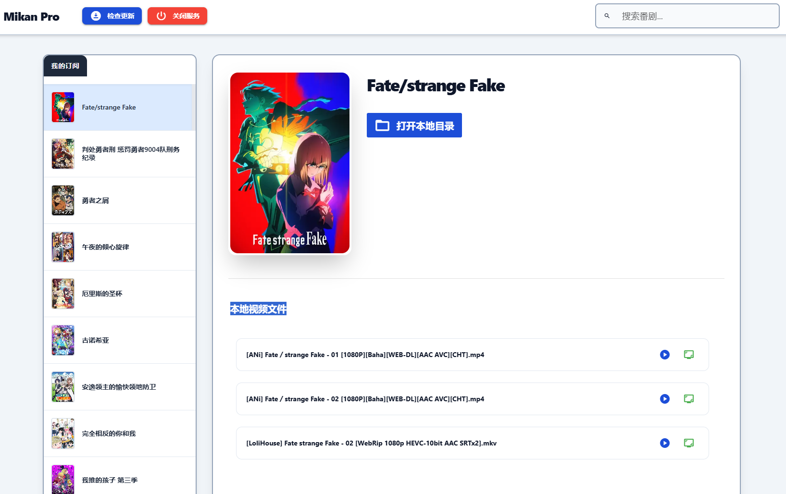

# SimpleDownloadAnime.py

这是一个基于 **NiceGUI** 开发的轻量化番剧订阅管理工具。它集成了 Mikan Project 的 RSS 订阅功能，支持一键推送至 qBittorrent 自动下载，并可直接调用本地播放器观影。

---
## 🛠️ 效果图

## 🚀 核心功能

* **顶部快捷栏**：集成“检查资源更新”与“关闭服务”按钮，操作触手可及。
* **智能订阅管理**：支持搜索番剧、自动抓取封面图以及 RSS 链接配置。
* **本地观影集成**：一键调用 **PotPlayer** 或 **弹弹Play**（支持加载弹幕）播放本地文件。
* **一键推送下载**：解析 RSS 更新列表，支持按字幕组分类勾选，直接推送至 qBittorrent。
* **环境自适应**：采用绝对路径逻辑，支持在任意文件夹下通过 `.bat` 运行，配置不丢失。

---

## 🛠️ 环境要求

在运行之前，请确保你的电脑已安装 **Python 3.8+**，并安装以下依赖库：
相关配置 根据自己的需要去改：
```bash
pip install nicegui requests qbittorrentapi
```

##  基础配置说明

在首次运行前，建议右键编辑 `config.json`，在文件顶部修改以下基础配置以匹配您的电脑环境：
```bash
CONFIG_FILE = "subscriptions.json"
DANDAN_PATH = r"D:\弹弹play\dandanplay.exe"
POTPLAYER_PATH = r"D:\app\PotPlayer\PotPlayerMini64.exe"
DEFAULT_PROXY = "socks5h://127.0.0.1:10808"
DEFAULT_QB_URL = 'http://127.0.0.1:8080'
DEFAULT_QB_USERNAME = ''
DEFAULT_QB_PASSWORD = ''
```
* **播放器路径**：
    * `DANDAN_PATH`: 弹弹Play 的安装全路径，用于加载弹幕播放。
    * `POTPLAYER_PATH`: PotPlayer 的安装全路径，用于纯净播放。
* **网络与下载**：
    * `DEFAULT_PROXY`: 必须配置。由于 Mikan 官网访问限制，请填写您的本地代理地址（如 `socks5h://127.0.0.1:10808`）。
    * `DEFAULT_QB_URL`: qBittorrent 的 WebUI 地址，默认为 `http://127.0.0.1:8080`。
    * `DEFAULT_QB_USERNAME/PASSWORD`: 您的 qB 登录凭据，若未设置密码可留空。

## 部署说明
有三种方式使用  1 直接使用exe版本 2 直接执行py文件  3 直接修改代码后自定义打包
### 1 下载exe版本

保证 有配置文件  config.json 
```bash
{
    "dandan_path": "C:\\弹弹play\\1dandanplay.exe",
    "potplayer_path": "C:\\app\\1PotPlayer\\1PotPlayerMini64.exe",
    "proxy": "socks5h://127.0.0.1:10808",
    "qb_url": "http://127.0.0.1:8080",
    "qb_username": "",
    "qb_password": "",
    "subscriptions_file": "subscriptions.json"
}
```
以及番剧订阅存储  subscriptions.json
```bash
{
    
    "Fate/strange Fake": {
        "rss_url": "https://mikanani.me/RSS/Bangumi?bangumiId=3503",
        "download_dir": "H:\\BT-Downloads\\番剧\\2026\\01",
        "items": [],
        "folder_name": "Fate/strange Fake",
        "cover_url": "https://mikanani.me/images/Bangumi/202501/06be31dd.jpg?width=400&height=560&format=webp"
    }
}
```


### 2 直接执行 启动脚本 运行py版本
在运行之前，请确保你的电脑已安装 **Python 3.8+**，并安装以下依赖库：
相关配置 根据自己的需要去改：
```bash
pip install -r requirements.txt
```
保证 有配置文件  config.json 
```bash
{
    "dandan_path": "C:\\弹弹play\\1dandanplay.exe",
    "potplayer_path": "C:\\app\\1PotPlayer\\1PotPlayerMini64.exe",
    "proxy": "socks5h://127.0.0.1:10808",
    "qb_url": "http://127.0.0.1:8080",
    "qb_username": "",
    "qb_password": "",
    "subscriptions_file": "subscriptions.json"
}
```
以及番剧订阅存储  subscriptions.json
```bash
{
    
    "Fate/strange Fake": {
        "rss_url": "https://mikanani.me/RSS/Bangumi?bangumiId=3503",
        "download_dir": "H:\\BT-Downloads\\番剧\\2026\\01",
        "items": [],
        "folder_name": "Fate/strange Fake",
        "cover_url": "https://mikanani.me/images/Bangumi/202501/06be31dd.jpg?width=400&height=560&format=webp"
    }
}
```
启动脚本bat

```bash
chcp 65001
@echo off
:: 检查是否是以最小化模式运行，如果不是，则调用自己并最小化
if "%1" == "min" goto :run
start /min "" "%~0" min
exit

:run
cd /d "%~dp0"

echo 正在启动后台服务...

:: 启动后台服务 (pythonw 本身不产生窗口)
start /b python SimpleDownloadAnime.py

:: 延迟 2 秒等待服务就绪后打开浏览器
timeout /t 2 /nobreak >nul
start "" "http://127.0.0.1:8105"

echo 服务已在后台运行，本窗口已最小化。
:: 如果你想让窗口一直挂着，可以去掉下面的 exit 或者换成 pause
exit
```
###  3 自己打包exe使用说明

在运行之前，请确保你的电脑已安装 **Python 3.8+**，并安装以下依赖库：
相关配置 根据自己的需要去改：
```bash
pip install nicegui requests qbittorrentapi
```
保证 有配置文件  config.json 
```bash
{
    "dandan_path": "C:\\弹弹play\\1dandanplay.exe",
    "potplayer_path": "C:\\app\\1PotPlayer\\1PotPlayerMini64.exe",
    "proxy": "socks5h://127.0.0.1:10808",
    "qb_url": "http://127.0.0.1:8080",
    "qb_username": "",
    "qb_password": "",
    "subscriptions_file": "subscriptions.json"
}
```
以及番剧订阅存储  subscriptions.json
```bash
{
    
    "Fate/strange Fake": {
        "rss_url": "https://mikanani.me/RSS/Bangumi?bangumiId=3503",
        "download_dir": "H:\\BT-Downloads\\番剧\\2026\\01",
        "items": [],
        "folder_name": "Fate/strange Fake",
        "cover_url": "https://mikanani.me/images/Bangumi/202501/06be31dd.jpg?width=400&height=560&format=webp"
    }
}
```
打包命令:
```bash
pyinstaller ^
  --onefile ^
  --windowed ^
  --icon=app_icon.ico ^
  --add-data "你的对于的地址Python\Python39\lib\site-packages\nicegui;nicegui" ^
  SimpleDownloadAnime.py
```


